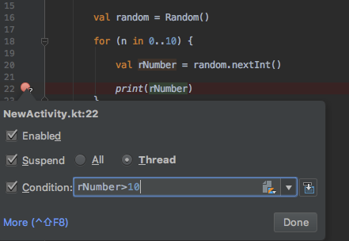
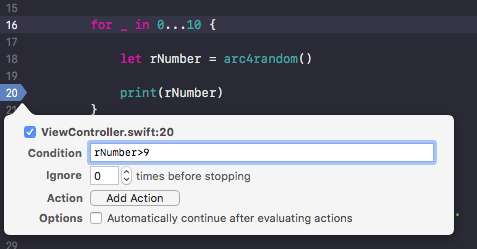
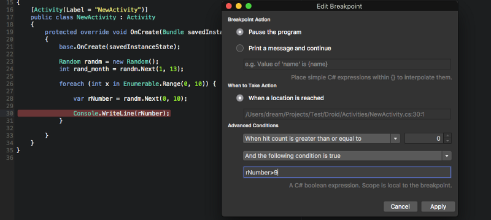

# Debug practices

### Debug steps diffrences

How debug step into, step over and step out works?

```C#
public class testprog {
    static void f (int x) {
        System.out.println ("num is " + (x+0)); // <- step into
    }

    static void g (int x) {
->      f(x); // <----------------------------------- current location
        f(1); // <----------------------------------- step over
    }

    public static void main (String args[]) {
        g(2);
        g(3); // <----------------------------------- step out of
    }
}
```
For more details. [see here](https://stackoverflow.com/a/3580851/8331040).

### Debugging conditional breakpoint

* Android studio

    Right click on a breakpoint and enter condition.

    

* Xcode

    1. Right click on a breakpoint
    2. Then click Edit Breakpoint and enter condition

    

    > Note: Action and Options used for logging and auto execute the breakpoint. In Actions, more actions are there.

* Visual studio

    1. Right click on a breakpoint
    2. Then click Edit Breakpoint and enter condition

    